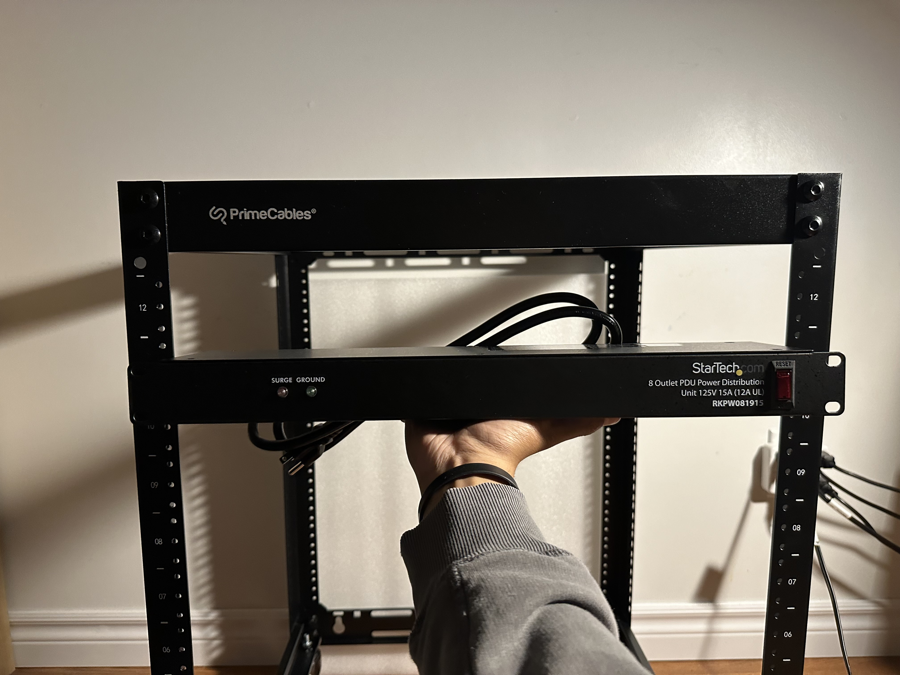
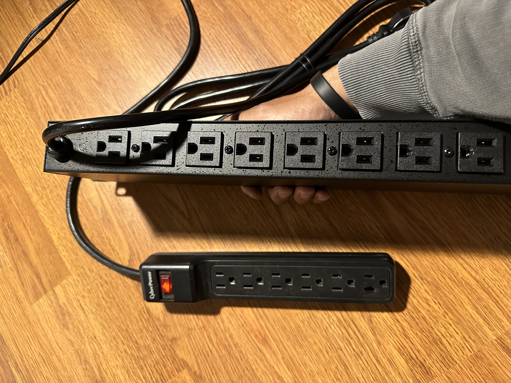

<h2> PDU (Power Distribution Unit) </h2>
 
 

 A PDU unit is when you need more sockets to plug into. I purchased a 125V 15A (12A UL) 8 outlet PDU from StarTech. Now what do those numbers even mean? 
  Well 125V means that the PDU is able to supply 125 volts of alternating current (AC). This is a little more than the North American standard for households or simple 
  office buildings of 120V. 15A (amperes) refers to the measure of the maximum amount of electrical current that it can handle safely. Now the 12A UL is a recommendation 
  that even though the PDU can handle up to 15A, it is best to use it up to 12A for safety by Underwriters Laboratory (UL). 
    
