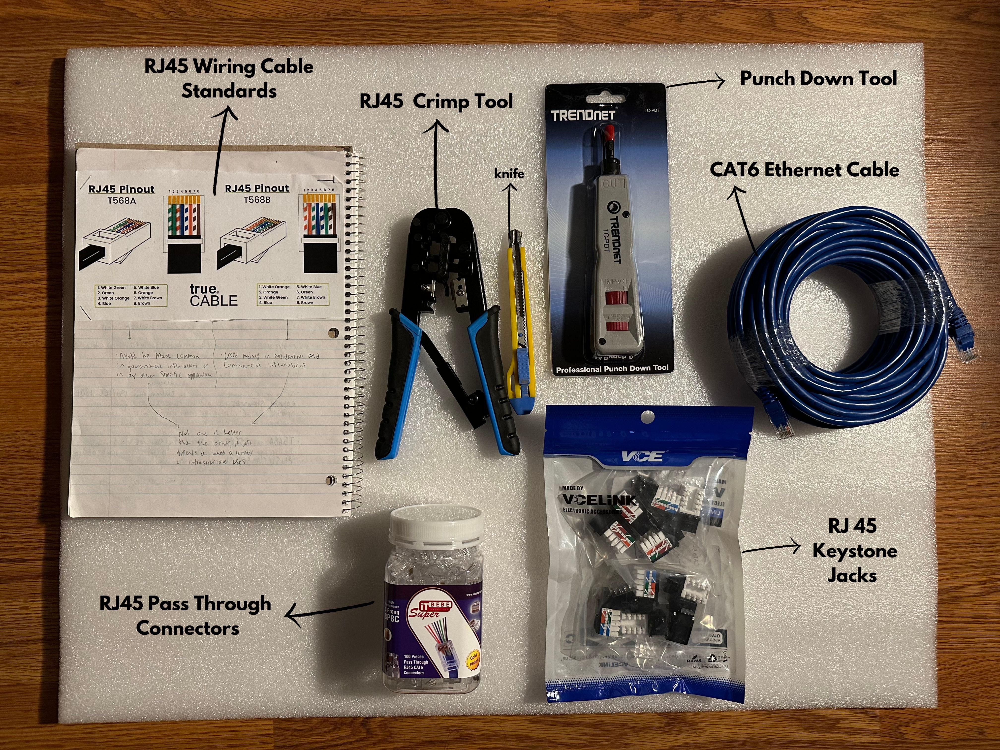

<h2> Patch Panel </h2>
 

 

 A major aspect to be mindful of is cable management; nobody wants a mess of cables that are hard to identify. To address this issue, purchasing a patch panel can significantly reduce the stress caused by messy cables. In my setup, it will be used to keep CAT6 ethernet cables organized. There are two approaches I considered: either buying small pre-made ethernet cables or making my own.

  

 I wanted to make my own and it requires many steps that I will link here 

