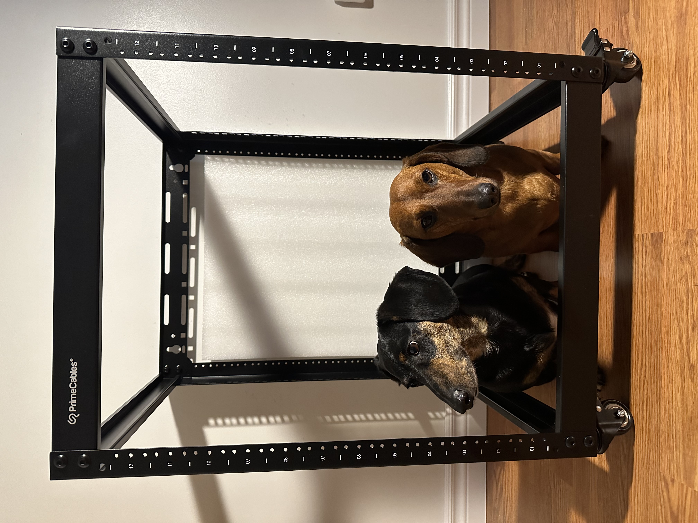
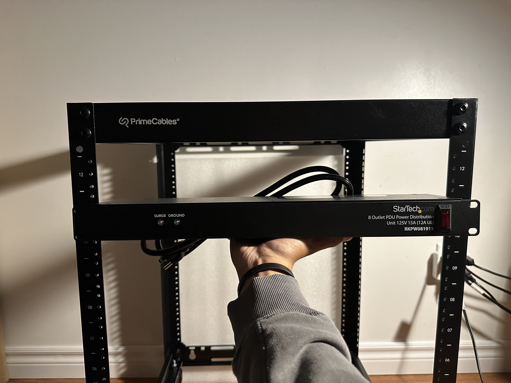
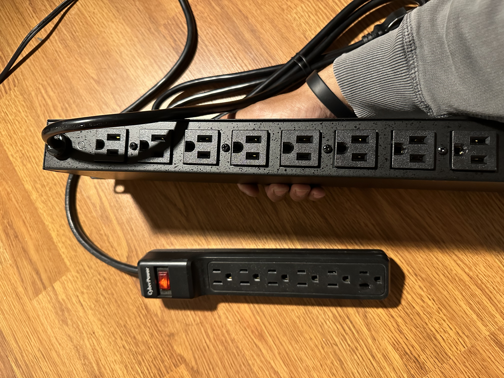

<h1> My Homelab</h1>

 In my opinion, a homelab is simply where you can learn and test new skills. More specifically, how you can utilize computing equipment to achieve various types of goals and tasks. This lab is meant to run as a media server, with the addition of programming, and conducting different cybersecurity tasks such as penetration testing, and cryptography. Not only that but it will be used to learn how to troubleshoot different types of hardwares and softwares.   

 
<h1> Components </h1>

<h2> Server Rack </h2>
   

 For neatness and ease of access, I went with a 12U rack from "Power cables", that fits 19-inch networking equipment. Each 1U is 1.75 inches tall, 
  therefore the height of this rack is 1.75 x 12U = 21 inches or 53.34cm tall. 
  It's not necessary to buy one for most common homeowners, however, it is much more organized as you can access what you need 
  without scattering through a bunch of equipment. These types of racks, rather much larger ones, are used in big organizations that
  need more space/power. Learning how to manage this, will help with understanding different types of hardware and how they work together.

   
  Remember a time when you had no internet at home, the first thing you might think is "router, router, router". Imagine those types of 
  equipments in one place, a server rack helps organize them. 
    

<h2> PDU (Power Distribution Unit) </h2>
 
 

 A PDU unit is when you need more sockets to plug into. I purchased a 125V 15A (12A UL) 8 outlet PDU from StarTech. Now what do those numbers even mean? 
  Well 125V means that the PDU is able to supply 125 volts of alternating current (AC). This is a little more than the North American standard for households or simple 
  office buildings of 120V. 15A (amperes) refers to the measure of the maximum amount of electrical current that it can handle safely. Now the 12A UL is a recommendation 
  that even though the PDU can handle up to 15A, it is best to use it up to 12A for safety by Underwriters Laboratory (UL). 
    
  
Now, consider how you plug devices into a wall outlet. The piece of equipment already attached to the wall, which is connected to the AC electrical circuit, is a socket (also known as a receptacle or outlet). The North American standard voltage is 120V, which is what these sockets supply. When you buy a technical device, it will most likely need to be plugged into the wall to function, such as a phone charger, lamp, speaker, or laptop. However, if you only have two sockets available but need to plug in four devices, you face a problem. This is where a PDU becomes useful. It provides multiple sockets, allowing you to plug in several devices simultaneously.

  
<h2> Patch Panel </h2>

 A major aspect to be mindful of is cable management; nobody want a mess of cables that is hard to identify. To troubleshoot this, purchasing a patch panel will definitely help with the stress load of 
messy cables. In this use case, it will be used to keep CAT6 ethernet cables organized. There are 2 ways I went about this, either buying small ethernet cables or making my own. 

