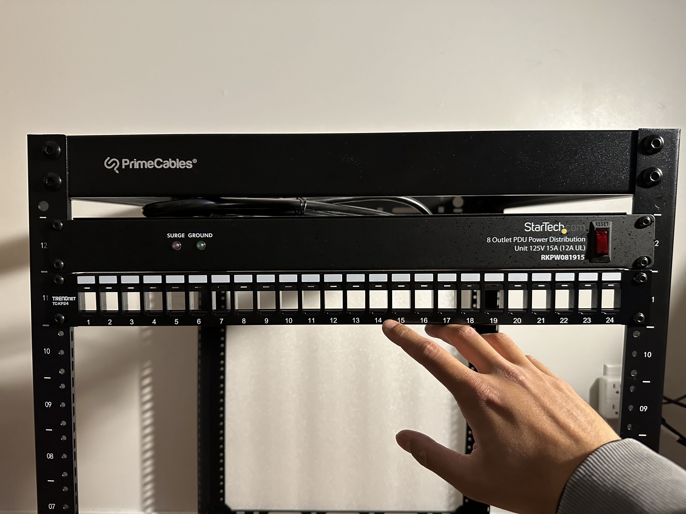
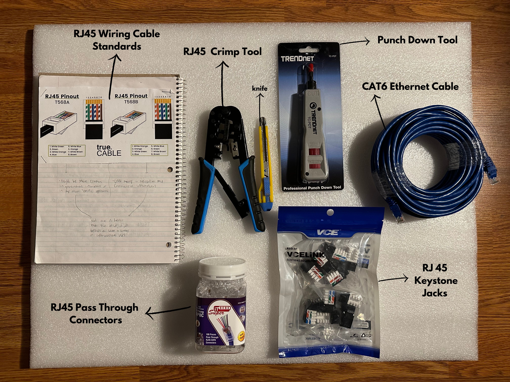

<h1> My Homelab</h1>

 
<h2> Welcome </h2>

 A homelab is a personal environment where you can learn and test new skills. More specifically, it’s a space to explore how computing equipment can be utilized to achieve various goals and tasks. My homelab is designed to function as a media server and to support programming, penetration testing, and cryptography activities. 
 
  
It will serve as a platform for learning how to troubleshoot different types of hardware and software. Addtionally, with the utilization of HTML, CSS, and JavaScript, I will be displaying the progression of my homelab, including mistakes, troubleshooting, and results.
  

Down below, you can click on each markdown to learn more about each of the components that I used.  🕹️
  
 

<h1> Components </h1>

- <h2> <a href="ServerRack.md"> Server Rack</a> </h2>
- <h2> <a href ="PDU.md"> PDU (Power Distribution Unit) </a> </h2>

  
Now, consider how you plug devices into a wall outlet. The piece of equipment already attached to the wall, which is connected to the AC electrical circuit, is a socket (also known as a receptacle or outlet). The North American standard voltage is 120V, which is what these sockets supply. When you buy a technical device, it will most likely need to be plugged into the wall to function, such as a phone charger, lamp, speaker, or laptop. However, if you only have two sockets available but need to plug in four devices, you face a problem. This is where a PDU becomes useful. It provides multiple sockets, allowing you to plug in several devices simultaneously.

  
<h2> Patch Panel </h2>
 

 

 A major aspect to be mindful of is cable management; nobody wants a mess of cables that are hard to identify. To address this issue, purchasing a patch panel can significantly reduce the stress caused by messy cables. In my setup, it will be used to keep CAT6 ethernet cables organized. There are two approaches I considered: either buying small pre-made ethernet cables or making my own.

  

 I wanted to make my own and it requires many steps that I will link here 

