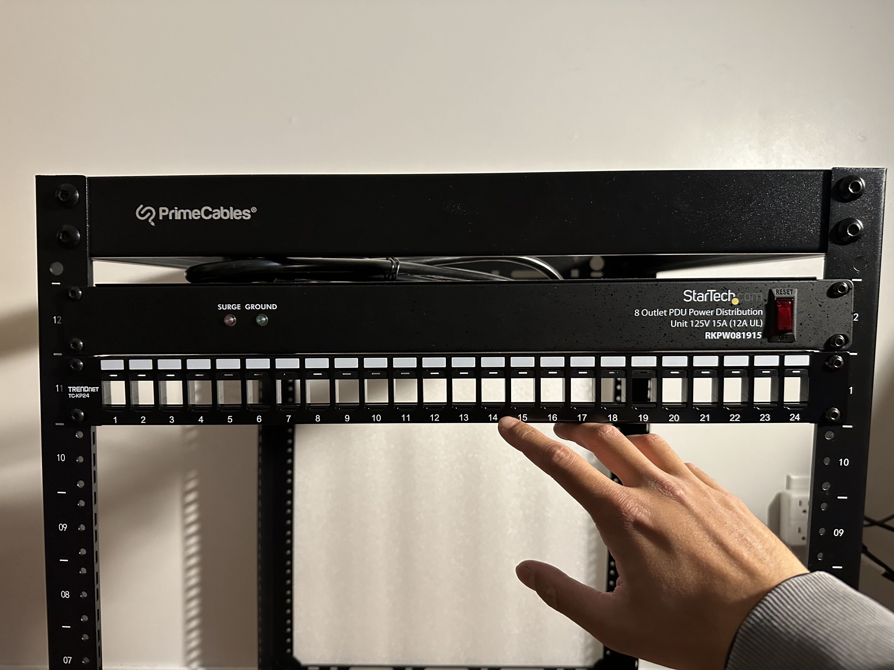
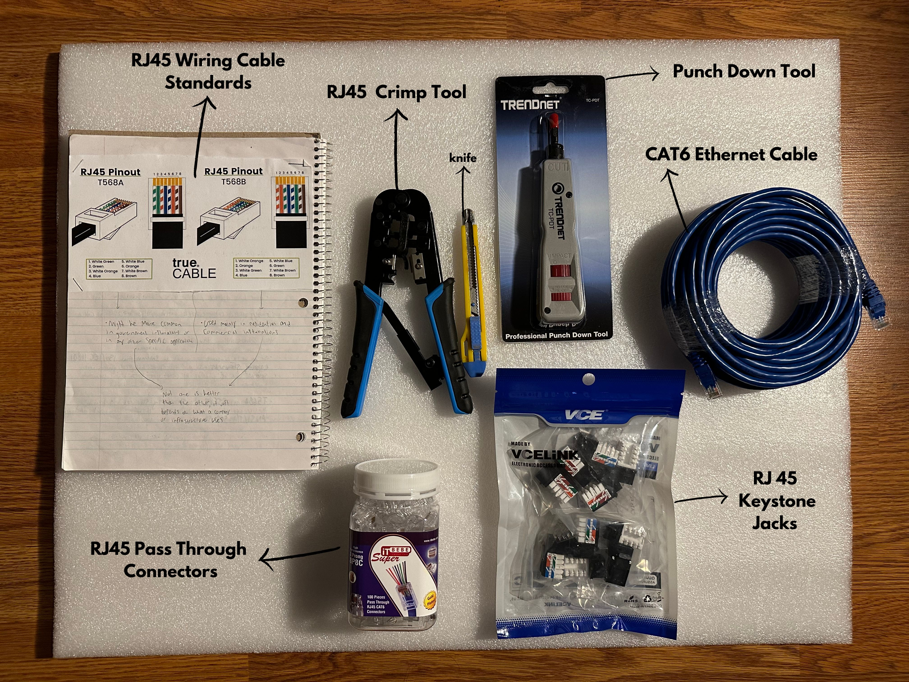

<h1> My Homelab</h1>

In my opinion, a homelab is a personal environment where you can learn and test new skills. More specifically, it’s a space to explore how computing equipment can be utilized to achieve various goals and tasks. My homelab is designed to function as a media server and to support programming, penetration testing, and cryptography activities. It will serve as a platform for learning how to troubleshoot different types of hardware and software. Addtionally, with the utilization of HTML, CSS, and JavaScript, I will be displaying the progression of my homelab, including mistakes, troubleshooting, and results.

 
<h1> Components </h1>

<h2> Server Rack </h2>
   

 For neatness and ease of access, I chose a 12U rack from "Power Cables" that fits 19-inch networking equipment. Each 1U is 1.75 inches tall, so the height of this rack is 1.75 x 12U = 21 inches or 53.34 cm tall. While it's not necessary for most homeowners to buy one, a rack offers a more organized setup, allowing easy access to equipment without having to scatter through a bunch of devices.

   
  
  These types of racks, albeit usually much larger, are used in big organizations that need more space and power. Learning how to manage a rack can help you understand different types of hardware and how they work together.
   
  
 Remember a time when you had no internet at home—the first thing you might think is "router, router, router." A server rack helps organize all those pieces of equipment in one place, making it easier to troubleshoot and manage.
    

<h2> PDU (Power Distribution Unit) </h2>
 
 

 A PDU unit is when you need more sockets to plug into. I purchased a 125V 15A (12A UL) 8 outlet PDU from StarTech. Now what do those numbers even mean? 
  Well 125V means that the PDU is able to supply 125 volts of alternating current (AC). This is a little more than the North American standard for households or simple 
  office buildings of 120V. 15A (amperes) refers to the measure of the maximum amount of electrical current that it can handle safely. Now the 12A UL is a recommendation 
  that even though the PDU can handle up to 15A, it is best to use it up to 12A for safety by Underwriters Laboratory (UL). 
    
  
Now, consider how you plug devices into a wall outlet. The piece of equipment already attached to the wall, which is connected to the AC electrical circuit, is a socket (also known as a receptacle or outlet). The North American standard voltage is 120V, which is what these sockets supply. When you buy a technical device, it will most likely need to be plugged into the wall to function, such as a phone charger, lamp, speaker, or laptop. However, if you only have two sockets available but need to plug in four devices, you face a problem. This is where a PDU becomes useful. It provides multiple sockets, allowing you to plug in several devices simultaneously.

  
<h2> Patch Panel </h2>
 

 

 A major aspect to be mindful of is cable management; nobody wants a mess of cables that are hard to identify. To address this issue, purchasing a patch panel can significantly reduce the stress caused by messy cables. In my setup, it will be used to keep CAT6 ethernet cables organized. There are two approaches I considered: either buying small pre-made ethernet cables or making my own.

 
