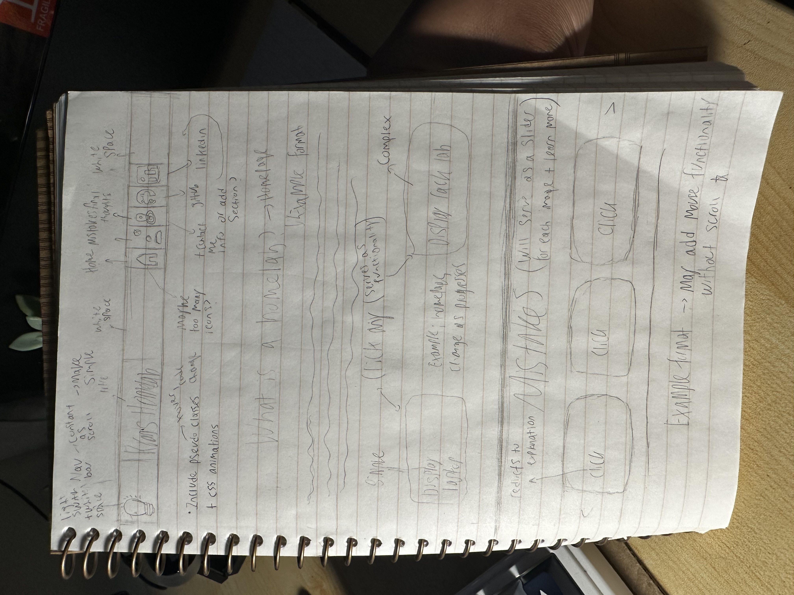

<h1> My Homelab 👨‍💻 </h1>

 
<h2> Welcome </h2>

 A homelab is a personal environment where you can learn and test new skills. More specifically, it’s a space to explore how computing equipment can be utilized to achieve various goals and tasks. My homelab is designed to deploy Docker, Proxmox, Plex, PiKVM, Pi-hole, Kubernetes, and more! It will serve as a platform for learning how to troubleshoot different types of hardware and software with the addition of developing future projects!

  
 
 With the utilization of HTML, CSS, and JavaScript, I will be displaying the progression of my homelab, mistakes made, and the results. 

 Down below, you can click on each markdown to learn more about each of the components that I used or you can click here [pending website] as well. 🕹️   

 
<h2> Rough Website Preview </h2>

  
 

<h1> Components </h1>

- <h2> <a href= "Markdown/ServerRack.md"> Server Rack </a> </h2>
- <h2> <a href= "Markdown/PDU.md"> PDU (Power Distribution Unit) </a> </h2>
- <h2> <a href= "Markdown/PatchPanel.md"> Patch Panel </a>  </h2>
- <h2> <a href="Markdown/Switch.md"> Switch </a> </h2>
- <h2> <a href="Markdown/shelf.md"> Shelf </a> </h2>
- <h2> <a href="Markdown/RackRails.md"> Server Rails </a> </h2>
- <h2> <a href="Markdown/ServerCase.md"> Server Case </a> </h2>

