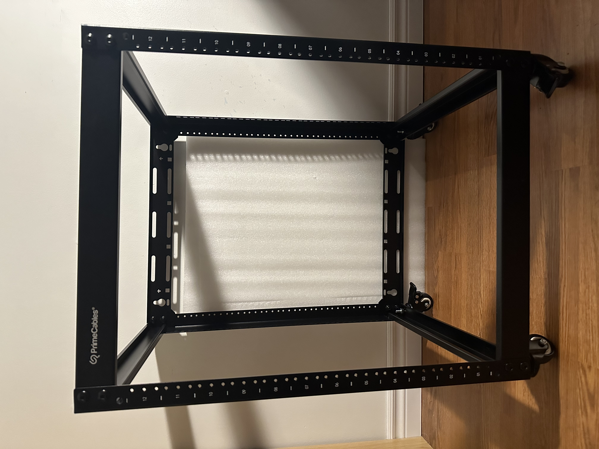

<h1>Ryan's Homelab</h1>

 In my opinion, a homelab is simply where you can learn and test new skills. More specifically, how you can utilize computing equipment to achieve various types of goals and tasks. This lab is meant to run as a media server, with the addition of programming, and conducting different cybersecurity tasks such as penetration testing, and cryptography. Not only that but it will be used to learn how to troubleshoot different types of hardwares and softwares.   

 
<h1> Components </h1>

<h2> Server Rack </h2>
   

 For neatness and ease of access, I went with a 12U rack from "Powercables", that fits 19 inch networking equipment. 
  It is not nessesarry to buy one for most common homeowners, however, these types of racks are used in larger organizations which are much larger. 
With the use of configuring such hardware, allows the ability to troubleshoot, test, and develop far easier

